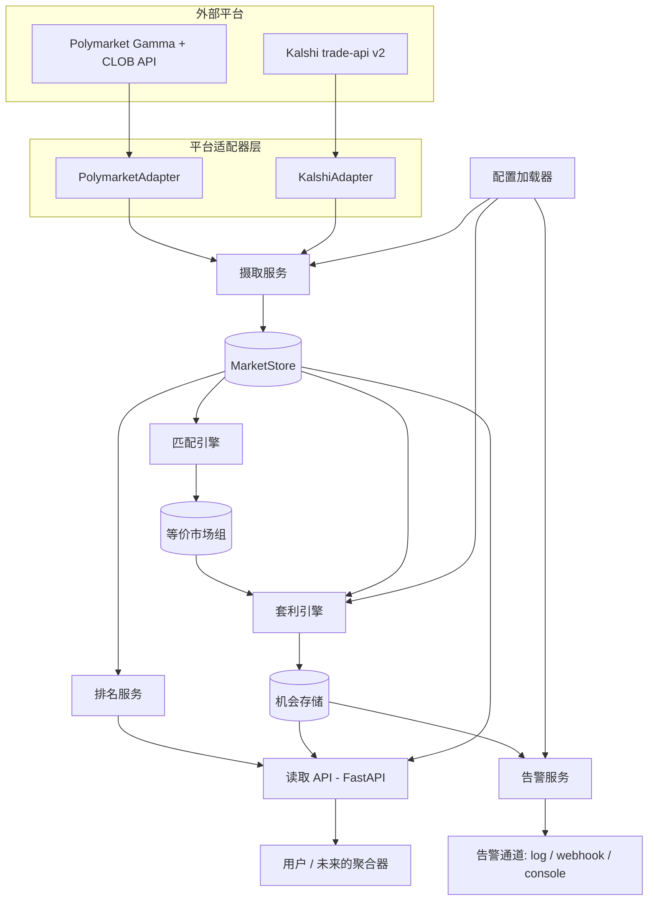
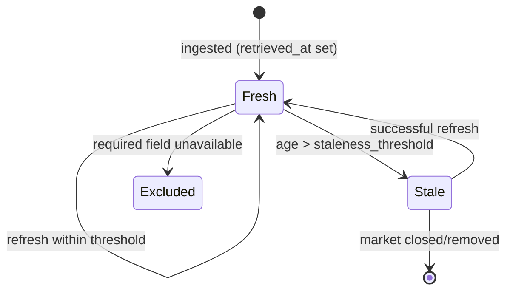
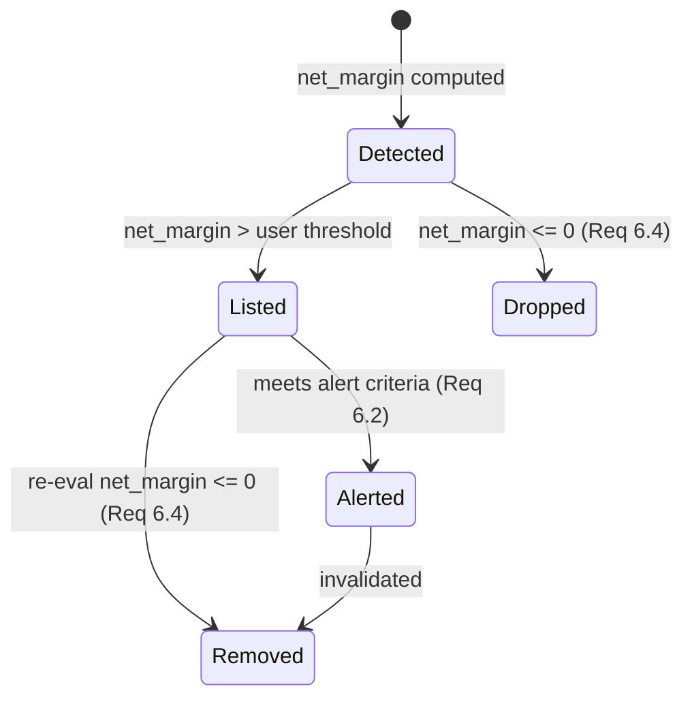

# 设计文档

## Overview

预测市场套利扫描器（Prediction Market Arbitrage Scanner）是一个后端服务，它持续从多个预测市场平台（初期为 Polymarket 和 Kalshi）摄取市场数据，将其规范化为一个规范模型，识别交易量和流动性最高的市场，跨平台匹配等价的市场，检测计入费用和价差后的跨平台套利机会，并通过查询 API 和可配置的告警呈现这些机会。

本设计实现了需求的第一阶段（Phase One）。它有意围绕一个可插拔的 `PlatformAdapter` 边界和一个读取 API 来构建，以便后续阶段（预测聚合器、更多平台、自动化执行）能够在无需返工核心的情况下分层叠加。

### 目标

- 可插拔的平台适配器；新增一个平台无需更改摄取、匹配或套利核心。
- 一个所有下游组件都消费的单一规范市场模型。
- 确定性、可测试的套利计算，计入费用和跨越价差的成本。
- 新鲜度保证：过期数据绝不会进入套利结果。

### 非目标（第一阶段）

- 自动化下单 / 执行。Scanner 只检测并呈现；它不进行交易。
- 一个精致的终端用户 Web UI。第一阶段暴露一个 JSON API 和一个轻量的 CLI/控制台视图；更丰富的 UI 是后续阶段。
- 超出新鲜度/告警所需范围之外的历史回测和分析存储。

### 技术选型

| 关注点 | 选择 | 理由 |
|---|---|---|
| 语言 / 运行时 | 带 `asyncio` 的 Python 3.11+ | 跨众多市场/平台的并发网络 I/O；数据处理方面生态强大；与两个平台的 Python 工具链一致。 |
| HTTP 客户端 | `httpx`（异步） | 带超时和连接池的异步 REST 轮询。 |
| WebSocket 客户端 | `websockets` | 在平台支持的场景下提供实时价格/订单簿流。 |
| API 层 | `FastAPI` + `uvicorn` | 带类型的请求/响应模型、异步、开箱即用的 OpenAPI——满足需求 7.4（供未来聚合使用的已定义接口）。 |
| 数据模型 | `pydantic` v2 | 在边界处对规范字段（价格界限、非负交易量）进行校验。 |
| 进程内存储 | 带接口的内存 `MarketStore`（基于 dict） | 第一阶段基于实时快照工作；该接口允许后续在不触及调用方的情况下替换为 Redis/Postgres。 |
| 调度 | `asyncio` 任务 + 间隔循环 | 每个适配器一个刷新循环；第一阶段无需外部调度器。 |
| 测试 | `pytest` + `pytest-asyncio` + `respx`（httpx 模拟） | 针对录制的 fixture，为适配器、匹配和套利计算提供确定性单元测试。 |

存储和告警发送都位于接口之后，因此内存版/第一阶段实现可以在不更改业务逻辑的情况下被替换。

## Architecture



### 组件职责

- **PlatformAdapter（接口 + 具体适配器）：** 连接到一个平台，获取市场 + 价格数据，规范化为 `CanonicalMarket`。承载所有平台特定的细节（单位、分页、鉴权）。_Req 1.1–1.2, 2.1–2.5, 7.2._
- **IngestionService：** 在刷新循环中驱动适配器，隔离单个适配器的故障，为记录打时间戳，标记过期数据，写入 `MarketStore`。_Req 1.1–1.6, 7.1, 7.3._
- **MarketStore：** 当前 `CanonicalMarket` 记录的快照，以 `(platform, market_id)` 为键。由接口支撑。_Req 7.4, 8.1._
- **RankingService：** 为 API 按交易量和流动性对市场进行排序/过滤。_Req 3.1–3.5._
- **MatchingEngine：** 跨平台将代表同一事件的市场分组，映射结果，分配 `match_confidence`。_Req 4.1–4.6._
- **ArbitrageEngine：** 评估各组，计算计入费用和价差后的 `net_profit_margin`，按流动性约束交易规模，记录机会。_Req 5.1–5.6, 8.2._
- **OpportunityStore：** 当前机会；移除已失效的机会。_Req 6.1, 6.4._
- **AlertService：** 将新机会与用户告警标准匹配，通过通道发送并带重试。_Req 6.2–6.3, 6.5._
- **读取 API（FastAPI）：** 暴露带新鲜度元数据的市场、组和机会；为用户和未来聚合器提供的稳定接口。_Req 3.3, 6.1, 7.4, 8.1._
- **ConfigLoader：** 在启动时加载已启用的适配器、阈值、告警配置。_Req 7.1, 7.3, 8.3–8.4._

### 流水线时序

每个已启用的适配器运行自己的刷新循环（默认 30 秒间隔，按需求 1.3 ≤60 秒）。在每个成功的摄取周期之后，流水线触发：重新排名 → 重新匹配（增量）→ 重新评估套利 → 发出告警。匹配是最昂贵的阶段，并被缓存（见匹配引擎）。

## Components and Interfaces

### 规范数据模型

```python
class Outcome(BaseModel):
    name: str                  # normalized: "YES" / "NO" (binary, Phase One)
    price: float               # implied probability, 0..1  (Req 2.2)
    bid: float | None          # best bid, 0..1 (for spread cost)
    ask: float | None          # best ask, 0..1
    available_liquidity_usd: float | None  # depth near top of book (Req 5.6)

class FieldStatus(str, Enum):
    OK = "ok"
    UNAVAILABLE = "unavailable"   # Req 2.4

class CanonicalMarket(BaseModel):
    platform: str                 # "polymarket" | "kalshi"
    market_id: str                # platform-native id/ticker
    title: str
    outcomes: list[Outcome]
    volume_usd: float | None      # Req 2.3, 3.1
    liquidity_usd: float | None   # Req 2.3, 3.2
    fee_rate: float | None        # 0..1, Req 2.5
    retrieved_at: datetime        # UTC, Req 1.4
    field_status: dict[str, FieldStatus]  # per-field availability + reason
    unavailable_reasons: dict[str, str]
    is_stale: bool = False        # Req 1.6 / 8.2

    @property
    def age_seconds(self) -> float: ...   # Req 8.1
```

适配器负责将原生价格转换为 0–1（Kalshi 为分/100；Polymarket 已是 0–1），并将原生交易量/流动性转换为美元。

### PlatformAdapter 接口

```python
class PlatformAdapter(Protocol):
    name: str
    async def fetch_markets(self) -> list[CanonicalMarket]:
        """Fetch active markets and normalize. Raises AdapterError on failure."""
    async def refresh_prices(
        self, markets: list[CanonicalMarket]
    ) -> list[CanonicalMarket]:
        """Refresh prices/liquidity for the given markets (cheaper than full fetch)."""
```

第一阶段的具体适配器：

- **PolymarketAdapter** —— 通过 Gamma API（`gamma-api.polymarket.com/markets?active=true&closed=false`）进行市场发现，通过公开的 CLOB API（无需鉴权）获取价格/订单簿。价格已是 0–1。交易量/流动性字段从 Gamma 读取。费率：在第一阶段配置中，Polymarket 对大多数市场不收取 maker/taker 费用（`fee_rate=0.0`），可通过配置覆盖。
- **KalshiAdapter** —— 通过 `GET /trade-api/v2/markets` 获取市场，通过市场 ticker / 订单簿端点获取价格；可选的 WebSocket ticker 流用于低延迟更新。价格以分计 → 除以 100。Kalshi 费用按其费用表计算；由于费用相对于价格是非线性的，适配器从配置（默认 Kalshi 费用模型）为每个市场设置 `fee_rate`。

> 费用细节：Kalshi 的交易费为 `0.07 × price × (1-price) × contracts`（取整），它依赖于价格，而非固定费率。规范的 `fee_rate` 携带一个有效费率；ArbitrageEngine 从每个平台的 `FeeModel`（见下文）重新计算精确费用，而不是仅依赖固定费率。

### FeeModel

```python
class FeeModel(Protocol):
    def fee_for(self, price: float, contracts: float) -> float:
        """Return fee in USD for buying `contracts` of an outcome at `price`."""

class FlatFeeModel:   # Polymarket-style (often 0)
    rate: float
class KalshiFeeModel: # 0.07 * p * (1-p) per contract, rounded up per fill
    ...
```

费用模型由 ConfigLoader 为每个平台选择，将依赖价格的费用逻辑保持在通用引擎之外，同时仍满足需求 5.2。

### IngestionService

```python
class IngestionService:
    def __init__(self, adapters, store, *, refresh_interval=30,
                 fetch_timeout=30, staleness_threshold=60): ...
    async def run(self): ...          # starts one loop per adapter
    async def _cycle(self, adapter):  # fetch -> normalize -> timestamp -> store
        ...
```

映射到需求的行为：
- 每个已启用的适配器一个 `asyncio` 任务；每 `refresh_interval` 循环一次（≤60 秒，需求 1.3）。
- 每次适配器调用都包裹在 `asyncio.wait_for(..., timeout=fetch_timeout)` 中；超时/出错时，以适配器名称记录日志并继续其他适配器（需求 1.5）。最后一份正常数据保留在存储中。
- 在每条记录上打 `retrieved_at` 时间戳（需求 1.4）。
- 在每个周期后，为所有记录重新计算 `is_stale = age_seconds > staleness_threshold`（需求 1.6, 8.2）。过期记录被 ArbitrageEngine 跳过。

### MatchingEngine

跨平台匹配等价市场是核心技术风险。本设计采用分层、可解释的方法，而非一个不透明的模型：

1. **分块 / 候选生成：** 通过在粗粒度键（规范化的类别、收盘/到期日期、从标题中提取的关键实体，如人物/球队/股票代码）上对市场分桶，来缩减 O(N²) 的成对空间。只有共享同一分块的市场才会被比较。
2. **相似度评分：** 对每个候选对，从以下各项计算一个复合评分：
   - 标题语义相似度（token-set ratio + 可选的嵌入余弦相似度）。
   - 结算/收盘日期的接近程度。
   - 实体重叠（命名实体、数字、阈值，如 "above 4000"）。
   - 结果结构兼容性（双方都是二元 YES/NO）。
3. **结果映射：** 对齐结果（YES↔YES、NO↔NO；或当一个平台将问题表述为否定时进行反转）。如果某个市场的任一结果无法被映射，则该市场被从该组中排除（需求 4.6）。
4. **置信度：** 复合评分成为 `match_confidence` ∈ [0,1]（需求 4.4）。低于用户置信度阈值的组被从套利中排除（需求 4.5）。

```python
class EquivalentMarketGroup(BaseModel):
    group_id: str
    members: list[CanonicalMarket]
    outcome_map: list[OutcomeAlignment]   # canonical_outcome -> {platform: outcome_name, inverted: bool}
    match_confidence: float               # 0..1

class MatchingEngine:
    def match(self, markets: list[CanonicalMarket]) -> list[EquivalentMarketGroup]: ...
```

给定其输入和配置权重，该引擎是确定性的，因此可以用 fixture 对（已知匹配和已知不匹配）进行单元测试。嵌入相似度位于一个接口（`SemanticSimilarity`）之后，并带有一个廉价的词法默认实现，因此系统可以在没有外部模型的情况下运行，并可在后续升级。

### ArbitrageEngine

对于一个跨两个平台匹配的二元市场，规范的套利是：在 YES 便宜的平台上买入 YES，在 NO 便宜的平台上买入 NO。如果 `ask_yes(A) + ask_no(B) < 1`，那么组装每对所支付的成本就小于 1，而每对有保证可获得 1 的回报。

```
cost_per_pair   = ask_yes_A + ask_no_B
gross_margin    = (1 - cost_per_pair) / cost_per_pair
fees_per_pair   = feeModel_A.fee_for(ask_yes_A, 1) + feeModel_B.fee_for(ask_no_B, 1)
net_cost        = cost_per_pair + fees_per_pair
net_margin      = (1 - net_cost) / net_cost          # Net_Profit_Margin, Req 5.2
max_pairs       = min(liquidity_at_ask_yes_A, liquidity_at_ask_no_B)  # Req 5.6
```

- 使用 **ask** 价格（跨越价差的成本），而非中间价，满足"跨越价差的成本"（需求 5.2）。
- 只评估非过期的组（需求 5.1, 8.2）。
- 记录每个被评估组的机会，包括 ≤0 的利润率（需求 5.3）；OpportunityStore 基于阈值和有效性进行丢弃/保留（需求 6.4）。
- 建议交易规模受较薄一侧的可用流动性限制（需求 5.6）。
- 推广到 N 个成员的方式是：为每个规范结果选择提供最低 ask 的平台。

```python
class ArbitrageOpportunity(BaseModel):
    group_id: str
    event_title: str
    legs: list[ArbLeg]          # {platform, market_id, outcome, side="buy", price}
    net_profit_margin: float    # Req 5.4
    recommended_size_usd: float # Req 5.6
    detected_at: datetime       # Req 5.4
    data_age_seconds: float     # Req 8.1
```

### RankingService

```python
class RankingService:
    def rank(self, markets, *, by: Literal["volume","liquidity"],
             min_volume=None, min_liquidity=None) -> list[CanonicalMarket]: ...
```
按所选指标降序排序（需求 3.1–3.3）；阈值过滤器丢弃低于 `min_volume`/`min_liquidity` 的市场（需求 3.4–3.5）。指标为 `unavailable` 的市场排在最后。

### AlertService

```python
class AlertCriteria(BaseModel):
    min_net_profit_margin: float
    min_match_confidence: float | None
    platforms: list[str] | None

class AlertChannel(Protocol):
    async def send(self, alert: Alert) -> None: ...   # log / webhook / console

class AlertService:
    async def on_new_opportunities(self, opps: list[ArbitrageOpportunity]): ...
```
- 当一个新检测到的机会满足标准时触发（需求 6.2）。
- 告警载荷包括匹配到的事件、参与的平台、净利润率、检测时间戳（需求 6.3）。
- 发送失败时，记录日志并带退避重试最多 3 次（需求 6.5）。
- 去重：同一组的机会在它消失并重新出现之前不会被重复告警。

### 读取 API（FastAPI）

| 方法 | 路径 | 用途 | 需求 |
|---|---|---|---|
| GET | `/markets` | 已排名的市场；参数 `sort=volume\|liquidity`、`min_volume`、`min_liquidity` | 3.3, 3.4, 3.5, 8.1 |
| GET | `/groups` | 带置信度的等价市场组；参数 `min_confidence` | 4.4, 4.5 |
| GET | `/opportunities` | 当前机会，按净利润率降序排序；参数 `min_margin` | 5.5, 6.1, 8.1 |
| GET | `/health` | 每个适配器的状态、最近一次成功的周期、计数 | 1.5 |
| GET/PUT | `/config/alerts` | 查看/更新告警标准 | 6.2 |

每个市场/机会响应都包含 `data_age_seconds` 和 `is_stale`（需求 8.1）。该 API 是有文档记录、以 OpenAPI 描述的接口，供未来的聚合功能消费（需求 7.4）。

### 配置

```yaml
scanner:
  refresh_interval_seconds: 30
  fetch_timeout_seconds: 30
  staleness_threshold_seconds: 60      # Req 8.3 default; user override Req 8.4
  match_confidence_min: 0.6
platforms:
  - name: polymarket
    enabled: true
    fee_model: { type: flat, rate: 0.0 }
  - name: kalshi
    enabled: true
    api_key_env: KALSHI_API_KEY
    fee_model: { type: kalshi }
alerts:
  channels: [log]
  criteria: { min_net_profit_margin: 0.02 }
```
被禁用的平台被完全排除在摄取/匹配/检测之外（需求 7.3）。适配器按名称从此配置中加载（需求 7.1）。

## Data Models

规范模型是 `CanonicalMarket`（见上文）。市场记录的状态转换：



机会生命周期：



## Error Handling

| 场景 | 处理方式 | 需求 |
|---|---|---|
| 适配器抓取超时（>30 秒）或 HTTP 错误 | 以适配器名称记录日志；保留最后一份正常数据；继续其他适配器 | 1.5 |
| 某字段规范化失败 | 将字段标记为 `UNAVAILABLE`，记录原因；若为非必需字段则市场仍被摄取 | 2.4 |
| 市场缺失某个结果的价格 | 字段不可用 → 该组被排除在套利之外 | 2.4, 4.6 |
| 过期价格数据 | 标记 `is_stale`；排除在套利之外；仍在市场列表中带存续时间显示 | 1.6, 8.1, 8.2 |
| 结果映射不完整 | 该市场被从组中排除 | 4.6 |
| 告警发送失败 | 记录日志；带退避重试 ≤3 次 | 6.5 |
| 启动时平台鉴权/配置错误（例如 Kalshi 密钥缺失） | 禁用该适配器，记录日志；其他平台继续 | 7.1, 7.3 |

`AdapterError` 是适配器抛出的单一错误类型；IngestionService 是唯一决定隔离还是继续的地方，从而将故障策略集中管理。

## Testing Strategy

- **单元 —— 适配器：** 将录制的 JSON fixture（来自 Polymarket Gamma/CLOB 和 Kalshi `markets` 的真实结构）送入规范化过程；断言价格落在 0–1，交易量/流动性以美元计，单位已转换（Kalshi 分→概率），缺失字段被标记为 `UNAVAILABLE`。网络用 `respx` 模拟。_Req 2.x._
- **单元 —— ArbitrageEngine：** 表驱动的用例，带手工计算的预期 `net_profit_margin`，包括费用模型和价差；边界用例为利润率 = 0、负值，以及受流动性限制的规模计算。_Req 5.x._
- **单元 —— MatchingEngine：** 带标签的 fixture 对（真实匹配，如两个平台上的同一选举市场；以及困难负例，如两个不同日期边界的市场）；断言分组、结果映射（包括反转）、置信度排序，以及在结果未映射时的排除。_Req 4.x._
- **单元 —— RankingService：** 排序和阈值过滤、不可用指标处理。_Req 3.x._
- **单元 —— 过期处理：** 注入时钟的测试，断言过期记录被排除在套利之外，并在市场列表中带存续时间显示。_Req 1.6, 8.x._
- **集成 —— 流水线：** 两个带脚本化输出的伪适配器，贯穿 Ingestion → Match → Arbitrage → Alert；断言端到端机会出现，然后在价格收敛时消失（需求 6.4），以及在失败通道上的告警重试（需求 6.5）。
- **集成 —— API：** 在已填充数据的存储上用 FastAPI `TestClient`；断言每个端点的排序、过滤器和新鲜度字段。
- **契约 —— 适配器一致性：** 任何新适配器都必须通过的共享测试套件（返回有效的 `CanonicalMarket`，遵守超时），以强制实施需求 7.2 的可扩展性。
- **确定性：** 时间和网络被注入，因此所有测试都是确定性的且可离线运行。

时钟和网络在各处都被注入，因此整个套件可离线且确定性地运行。

## Correctness Properties

以下是实现必须维护的不变式；每一项都可在测试中检验，并映射回需求。

### Property 1: 价格界限

任何适配器生成的每个 `Outcome.price`、`bid` 和 `ask` 都在 `[0, 1]` 范围内。**Validates: Requirements 2.2**

### Property 2: 非负量

`volume_usd` 和 `liquidity_usd` 要么是 `None`/`UNAVAILABLE`，要么 `>= 0`。**Validates: Requirements 2.3**

### Property 3: 时间戳存在

每个被存储的 `CanonicalMarket` 都有一个 UTC 的 `retrieved_at`，并且对于一条固定记录，`age_seconds` 随挂钟时间单调变化。**Validates: Requirements 1.4, 8.1**

### Property 4: 故障隔离

如果一个适配器抛出异常或超时，每个其他已启用的适配器的数据在同一周期内仍会被摄取。**Validates: Requirements 1.5**

### Property 5: 过期排除

绝不会从一个含有底层价格 `age_seconds > staleness_threshold` 的结果的组中推导出任何 `ArbitrageOpportunity`。**Validates: Requirements 1.6, 8.2**

### Property 6: 完整的结果映射

`EquivalentMarketGroup` 中的每个市场都映射了其全部结果；否则它就不是成员。**Validates: Requirements 4.6**

### Property 7: 置信度范围

每个组的 `match_confidence` ∈ `[0, 1]`，并且低于已配置阈值的组绝不会到达 ArbitrageEngine。**Validates: Requirements 4.4, 4.5**

### Property 8: 费用与价差核算

`net_profit_margin` 从 ask 价格和平台费用模型计算得出；对于相同的输入，它等于手工计算的值，并且 `net_margin <= gross_margin` 始终成立。**Validates: Requirements 5.2**

### Property 9: 受流动性限制的规模

`recommended_size_usd` 绝不会超过组中最薄一腿的可用流动性。**Validates: Requirements 5.6**

### Property 10: 机会排序

`/opportunities` 返回的结果按 `net_profit_margin` 降序排序，且不包含任何 `net_profit_margin <= 0` 的机会。**Validates: Requirements 6.1, 6.4**

### Property 11: 告警发送上限

一个失败的告警通道每个机会最多重试 3 次，并且某个给定机会在它消失并重新出现之前最多被告警一次。**Validates: Requirements 6.5**

### Property 12: 配置驱动的成员资格

一个被禁用的平台对摄取、匹配和检测贡献零个市场。**Validates: Requirements 7.3**
