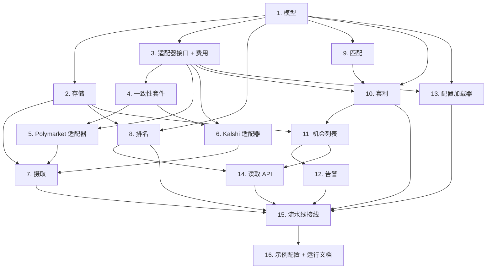

# Implementation Plan

## Overview

本计划按依赖顺序实现预测市场套利扫描器：先是规范模型和存储，然后是适配器边界和具体适配器，接着是摄取，再然后是匹配/套利/告警核心，最后是 API 和端到端接线。每个任务都是测试驱动的，并映射到设计中的需求和正确性属性。该套件被构建为通过注入时钟和模拟网络来离线且确定性地运行。

## Tasks

- [x] 1. 搭建项目骨架与规范数据模型
  - 创建 Python 包布局（`scanner/`、`tests/`），`pyproject.toml` 声明 `httpx`、`websockets`、`fastapi`、`uvicorn`、`pydantic>=2`，以及开发依赖 `pytest`、`pytest-asyncio`、`respx`。
  - 实现 `scanner/models.py`，包含 `Outcome`、`FieldStatus` 和 `CanonicalMarket` pydantic 模型，包括 `age_seconds` 以及强制价格 ∈ [0,1] 和非负交易量/流动性的校验器。
  - 添加 `EquivalentMarketGroup`、`OutcomeAlignment`、`ArbLeg` 和 `ArbitrageOpportunity` 模型。
  - 编写单元测试，断言价格界限和非负校验器拒绝无效输入并接受有效输入。
  - _Requirements: 2.1, 2.2, 2.3_
  - _Properties: Property 1, Property 2_

- [x] 2. 实现 MarketStore 接口与内存存储
  - 在 `scanner/store.py` 中定义一个 `MarketStore` Protocol（upsert 市场、按键获取、列出全部、按平台列出）。
  - 实现以 `(platform, market_id)` 为键的 `InMemoryMarketStore`。
  - 实现一个 `OpportunityStore`（upsert、按净利润率降序列出、按 group_id 移除）。
  - 编写单元测试，验证 upsert/get/list 行为以及机会的排序/移除。
  - _Requirements: 6.1, 7.4_
  - _Properties: Property 10_

- [x] 3. 定义 PlatformAdapter 接口与费用模型
  - 在 `scanner/adapters/base.py` 中定义 `PlatformAdapter` Protocol（`fetch_markets`、`refresh_prices`）和一个 `AdapterError` 类型。
  - 在 `scanner/fees.py` 中实现 `FeeModel` Protocol，包含 `FlatFeeModel` 和 `KalshiFeeModel`（每合约 0.07·p·(1-p)）。
  - 针对手工计算的值为两个费用模型编写单元测试，包括价格极值。
  - _Requirements: 2.5, 5.2, 7.2_
  - _Properties: Property 8_

- [x] 4. 构建一个可复用的适配器一致性测试套件
  - 在 `tests/adapter_contract.py` 中创建一个参数化的 pytest 套件，任何适配器都必须通过：返回有效的 `CanonicalMarket`（价格在 [0,1]，美元量级，时间戳已设置），并遵守抓取超时。
  - 提供一个带脚本化输出的 `FakeAdapter` 来验证该套件本身。
  - _Requirements: 7.2_
  - _Properties: Property 1, Property 2, Property 3_

- [x] 5. 实现 PolymarketAdapter
  - 在 `scanner/adapters/polymarket.py` 中，针对 Gamma API（`gamma-api.polymarket.com/markets?active=true&closed=false`）实现市场发现，并针对公开的 CLOB API 实现价格/订单簿读取。
  - 规范化为 `CanonicalMarket`：价格已是 0–1，将交易量/流动性映射为美元，从 `FlatFeeModel` 设置 `fee_rate`，填充用于价差成本的 bid/ask，将缺失字段标记为 `UNAVAILABLE` 并附原因。
  - 使用 `respx` 在录制的 JSON fixture 上添加单元测试；包含一个带缺失字段的 fixture 以断言 `UNAVAILABLE` 处理。针对一致性套件运行。
  - _Requirements: 1.1, 1.2, 2.1, 2.2, 2.3, 2.4, 2.5_
  - _Properties: Property 1, Property 2_

- [x] 6. 实现 KalshiAdapter
  - 在 `scanner/adapters/kalshi.py` 中实现市场列表（`GET /trade-api/v2/markets`）和价格/订单簿读取，使用来自配置/环境的 API 密钥鉴权。
  - 规范化：将分→概率转换（÷100），将交易量/流动性映射为美元，附加 `KalshiFeeModel`，填充 bid/ask，标记缺失字段。
  - 使用 `respx` fixture 添加单元测试，包括分→概率转换和缺失字段处理。针对一致性套件运行。
  - _Requirements: 1.1, 1.2, 2.1, 2.2, 2.3, 2.4, 2.5_
  - _Properties: Property 1, Property 2_

- [x] 7. 实现带故障隔离和过期处理的 IngestionService
  - 实现 `scanner/ingestion.py`，为每个已启用的适配器以 `refresh_interval`（≤60 秒）运行一个 `asyncio` 循环，将每次适配器调用包裹在 `asyncio.wait_for(timeout=fetch_timeout)` 中。
  - 超时/出错时，以适配器名称记录日志，保留最后一份正常数据，继续其他适配器；成功时打 `retrieved_at` 时间戳；每个周期针对 `staleness_threshold` 重新计算 `is_stale`。
  - 编写带注入时钟和伪适配器的单元测试：一个适配器失败不会阻塞其他适配器；过期记录被标记；时间戳被设置。
  - _Requirements: 1.1, 1.2, 1.3, 1.4, 1.5, 1.6, 8.2, 8.3_
  - _Properties: Property 3, Property 4, Property 5_

- [x] 8. 实现 RankingService
  - 实现 `scanner/ranking.py`，按交易量或流动性降序排序并应用 `min_volume`/`min_liquidity` 过滤器，将指标不可用的市场排在最后。
  - 编写单元测试，验证排序顺序、阈值过滤，以及不可用指标的排位。
  - _Requirements: 3.1, 3.2, 3.3, 3.4, 3.5_

- [x] 9. 实现 MatchingEngine
  - [x] 9.1 实现分块与 SemanticSimilarity 接口
    - 在 `scanner/matching.py` 中实现候选生成的分块（类别、收盘日期、提取的实体）以及一个带词法默认实现（token-set ratio）的 `SemanticSimilarity` 接口。
    - 编写单元测试，断言分块减少了候选对，且词法相似度对已知对给出合理评分。
    - _Requirements: 4.1_
  - [x] 9.2 实现评分、结果映射与置信度
    - 计算复合相似度，对齐结果（包括反转的 YES/NO），分配 `match_confidence` ∈ [0,1]，并在任一结果无法被映射时排除该市场。
    - 编写带标签的真实匹配和困难负例 fixture 的单元测试，断言分组、反转映射、置信度范围，以及在结果未映射时的排除。
    - _Requirements: 4.2, 4.3, 4.4, 4.6_
    - _Properties: Property 6, Property 7_

- [x] 10. 实现 ArbitrageEngine
  - 实现 `scanner/arbitrage.py`：对每个非过期的组，为每个规范结果选择最低 ask 的平台，从 ask 价格减去费用模型费用计算 `net_profit_margin`，按最薄一腿的流动性限制建议规模，并记录一个 `ArbitrageOpportunity`（包括 ≤0 的利润率），附带各腿、价格和检测时间戳。
  - 强制跳过过期的组和低于置信度阈值的组。
  - 编写表驱动的单元测试，带手工计算的预期利润率，包括利润率=0、负值，以及受流动性限制的规模计算；断言过期/低置信度的组被排除。
  - _Requirements: 4.5, 5.1, 5.2, 5.3, 5.4, 5.6, 8.2_
  - _Properties: Property 5, Property 7, Property 8, Property 9_

- [x] 11. 实现机会列表与阈值过滤
  - 将 ArbitrageEngine 的输出接入 `OpportunityStore`：按用户的 `min_net_profit_margin` 过滤，移除利润率降至 ≤0 的机会，保持列表按净利润率降序排序。
  - 编写单元测试，断言阈值过滤、失效时的移除以及排序。
  - _Requirements: 5.5, 6.1, 6.4_
  - _Properties: Property 10_

- [x] 12. 实现带通道和重试的 AlertService
  - 实现 `scanner/alerts.py`，包含 `AlertCriteria`、一个 `AlertChannel` Protocol，以及 `LogChannel`/`WebhookChannel` 实现；在满足标准的新机会上触发，构建包含匹配事件、平台、净利润率和时间戳的载荷。
  - 带退避重试失败的发送最多 3 次；去重，使一个机会在它消失并重新出现之前最多被告警一次。
  - 编写单元测试：标准匹配、载荷内容、在失败通道上重试至多 3 次，以及去重行为。
  - _Requirements: 6.2, 6.3, 6.5_
  - _Properties: Property 11_

- [x] 13. 实现 ConfigLoader
  - 实现 `scanner/config.py` 来加载 YAML 配置：已启用的适配器（按名称）、费用模型、刷新/超时/过期设置（默认过期 60 秒，用户可覆盖）、匹配置信度最小值，以及告警配置。
  - 确保被禁用的平台在各处都被排除，且缺失 Kalshi API 密钥仅禁用该适配器。
  - 编写单元测试，验证适配器的启用/禁用、默认 vs. 被覆盖的过期设置，以及对缺失密钥的优雅处理。
  - _Requirements: 7.1, 7.3, 8.3, 8.4_
  - _Properties: Property 12_

- [x] 14. 实现读取 API（FastAPI）
  - 实现 `scanner/api.py`，包含 `GET /markets`（排序/阈值参数）、`GET /groups`（`min_confidence`）、`GET /opportunities`（`min_margin`，降序排序）、`GET /health`（每个适配器的状态），以及 `GET/PUT /config/alerts`。
  - 在每个市场/机会响应上包含 `data_age_seconds` 和 `is_stale`。
  - 在已填充数据的存储上用 `TestClient` 编写 API 测试，断言排序顺序、过滤器、新鲜度字段和健康输出。
  - _Requirements: 3.3, 3.4, 3.5, 4.4, 4.5, 5.5, 6.1, 7.4, 8.1_
  - _Properties: Property 10_

- [x] 15. 接线端到端流水线与应用入口点
  - 实现 `scanner/app.py`，组合 ConfigLoader → 适配器 → IngestionService → Matching → Arbitrage → OpportunityStore → AlertService，并在 `uvicorn` 下挂载 API。
  - 在每个摄取周期后，触发重新排名 → 重新匹配 → 重新评估 → 发出告警。
  - 编写一个集成测试，用两个伪适配器驱动完整流水线：一个机会出现，一个告警触发（在失败通道上带重试），并且当价格收敛时机会消失。
  - _Requirements: 1.1, 6.2, 6.4, 6.5, 7.1, 7.4_
  - _Properties: Property 4, Property 10, Property 11_

- [x] 16. 添加示例配置、fixture 和运行说明
  - 添加一个示例 `config.yaml`、适配器测试所用的录制 JSON fixture，以及一个简短的 `README` 章节，描述如何运行扫描器和测试套件。
  - 验证整个测试套件可离线且确定性地运行（注入时钟和模拟网络）。
  - _Requirements: 7.1, 8.3, 8.4_

## Task Dependency Graph



```json
{
  "waves": [
    { "wave": 1, "tasks": ["1"] },
    { "wave": 2, "tasks": ["2", "3"] },
    { "wave": 3, "tasks": ["4", "8", "9", "13"] },
    { "wave": 4, "tasks": ["5", "6"] },
    { "wave": 5, "tasks": ["7", "10"] },
    { "wave": 6, "tasks": ["11"] },
    { "wave": 7, "tasks": ["12", "14"] },
    { "wave": 8, "tasks": ["15"] },
    { "wave": 9, "tasks": ["16"] }
  ]
}
```

## Notes

- 任务 5 和 6（两个适配器）彼此独立，一旦任务 3 和 4 完成即可并行进行。
- 任务 8（排名）和 9（匹配）彼此独立，在它们共享的模型/存储依赖之后即可并行推进。
- 每个任务都包含自己的测试；任务 15 添加跨组件集成测试，任务 16 验证该套件可离线且确定性地运行。
- 本计划范围内不包含自动化交易执行；按照设计第一阶段的非目标，扫描器仅检测并呈现机会。
