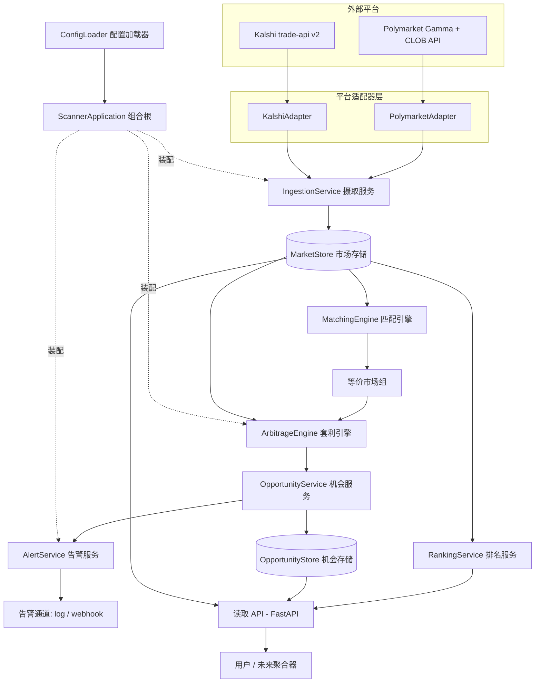
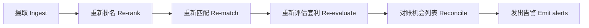
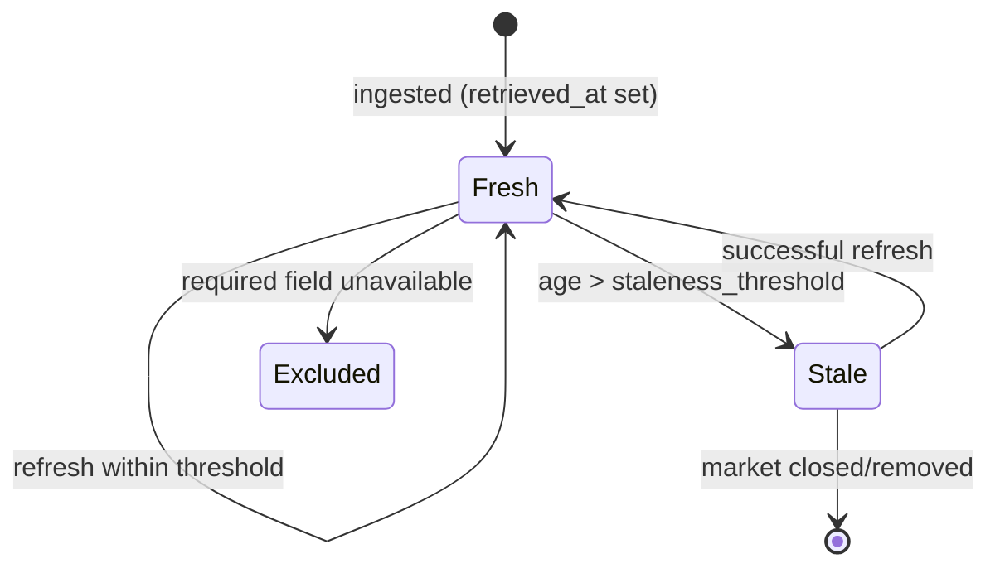
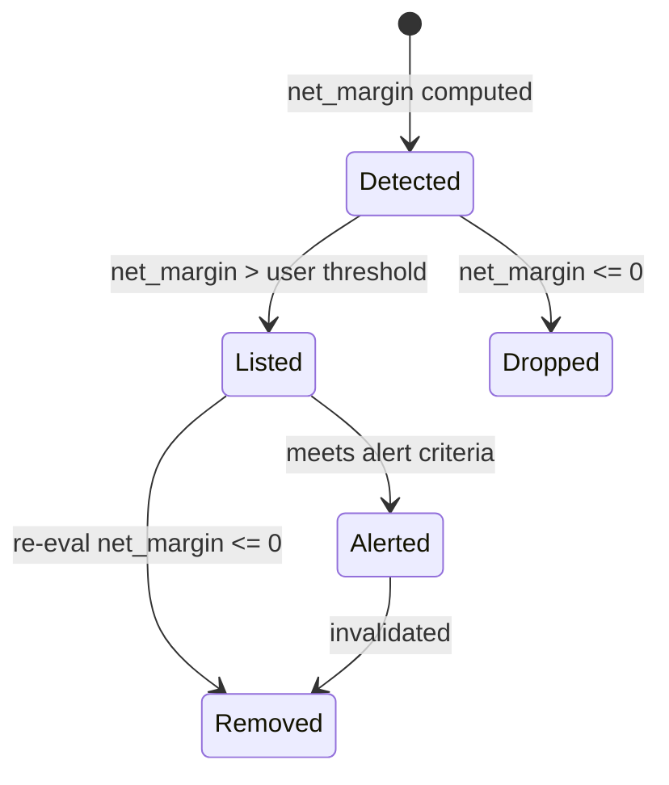

# 02 · 架构设计

## 1. 设计原则

整个系统围绕四条原则构建：

1. **可插拔的平台适配器**：新增一个平台不应改动摄取、匹配、套利核心。所有平台特定逻辑（单位换算、分页、鉴权）都封装在适配器内。
2. **单一规范模型**：所有下游组件只消费 `CanonicalMarket`，不感知任何平台细节。
3. **确定性、可测试**：套利计算、匹配评分给定输入即确定输出；时间与网络都可注入，使整个测试套件离线、可复现。
4. **新鲜度保证**：过期数据绝不进入套利结果。

## 2. 系统总体架构

## 3. 端到端数据流

每个摄取周期之后，流水线按固定顺序执行：

1. **摄取**：每个启用的适配器在自己的 `asyncio` 循环里抓取行情，打 `retrieved_at` 时间戳，重算 `is_stale`，写入 `MarketStore`。单个适配器失败被隔离，不影响其他平台。
2. **重新排名**：按交易量 / 流动性整理市场视图（API 按需消费）。
3. **重新匹配**：`MatchingEngine` 将代表同一事件的跨平台市场分组，输出 `match_confidence`。
4. **重新评估套利**：`ArbitrageEngine` 对非过期、达置信度阈值的组计算净利润率。
5. **对账机会列表**：`OpportunityService` 过滤（去掉 ≤0 与低于阈值的）、排序，写入 `OpportunityStore`。
6. **发出告警**：`AlertService` 对满足条件的新机会发告警，带重试与去重。

## 4. 组件职责一览

| 组件 | 模块 | 职责 | 对应需求 |
|---|---|---|---|
| PlatformAdapter | `adapters/` | 连接单个平台，抓取并规范化为 `CanonicalMarket` | 1.1–1.2, 2.1–2.5, 7.2 |
| IngestionService | `ingestion.py` | 刷新循环、故障隔离、时间戳、过期标记 | 1.1–1.6, 7.1, 7.3 |
| MarketStore | `store.py` | 当前市场快照，键 `(platform, market_id)` | 7.4, 8.1 |
| RankingService | `ranking.py` | 按量/流动性排序与阈值过滤 | 3.1–3.5 |
| MatchingEngine | `matching.py` | 跨平台分组、结果映射、置信度 | 4.1–4.6 |
| ArbitrageEngine | `arbitrage.py` | 净利润率计算、流动性限规模 | 5.1–5.6, 8.2 |
| OpportunityService / Store | `opportunities.py` / `store.py` | 机会过滤、排序、失效移除 | 5.5, 6.1, 6.4 |
| AlertService | `alerts.py` | 匹配告警标准、多通道发送、重试、去重 | 6.2–6.3, 6.5 |
| 读取 API | `api.py` | 暴露市场/组/机会 + 新鲜度元数据 | 3.3, 6.1, 7.4, 8.1 |
| ConfigLoader | `config.py` | 启动时加载启用适配器、阈值、告警配置 | 7.1, 7.3, 8.3–8.4 |
| ScannerApplication | `app.py` | 组合根：装配全部组件 + uvicorn 入口 | 1.1, 7.1, 7.4 |

各模块的接口签名与协作细节见 [04-模块详解.md](./04-模块详解.md)。

## 5. 关键架构决策

### 5.1 接口隔离的存储与告警
`MarketStore` 是 Protocol，第一阶段是内存 dict 实现；未来可替换为 Redis/Postgres 而不动调用方。告警通道同理位于 `AlertChannel` Protocol 之后。

### 5.2 费用逻辑独立于套利引擎
价格依赖型费用（Kalshi）封装在 `FeeModel` 里，由配置按平台选择。套利引擎只调用 `fee_model.fee_for(price, contracts)`，保持通用。

### 5.3 匹配的可解释分层
匹配不用「黑盒模型」，而是分块（blocking）→ 复合评分 → 结果映射的可解释流程。语义相似度在 `SemanticSimilarity` 接口之后，默认词法实现可离线运行，后续可换嵌入模型。

### 5.4 故障策略集中化
适配器只抛 `AdapterError`，是否隔离/继续的决策唯一地在 `IngestionService` 做出，避免故障处理逻辑散落各处。

## 6. 市场记录状态机

## 7. 机会生命周期

> 本文档是规格 `design.md` 的工程视角展开。当架构发生变化时，应同时更新 `design.md` 与本文件，并在 [09-变更日志.md](./09-变更日志.md) 记录。
