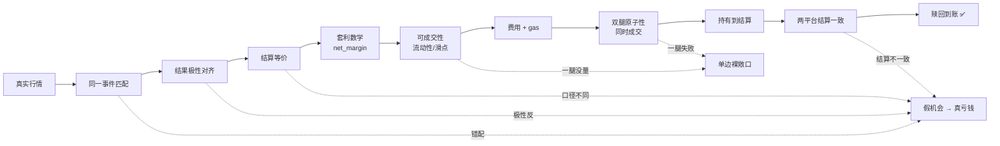
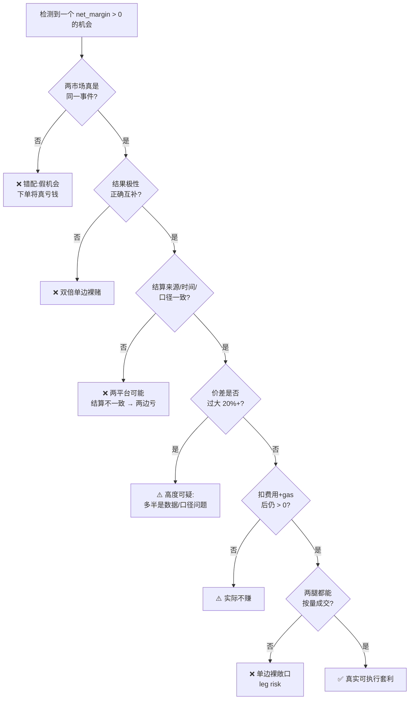
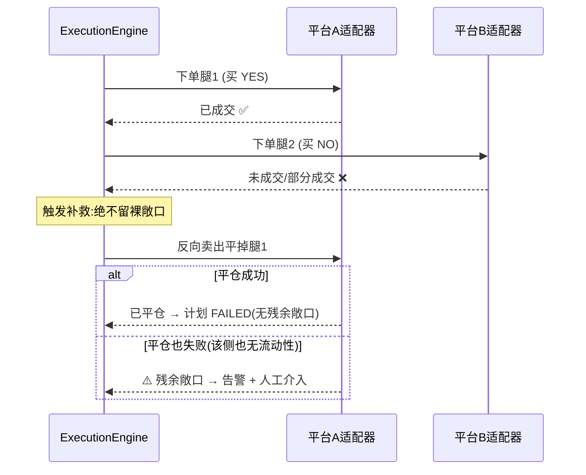
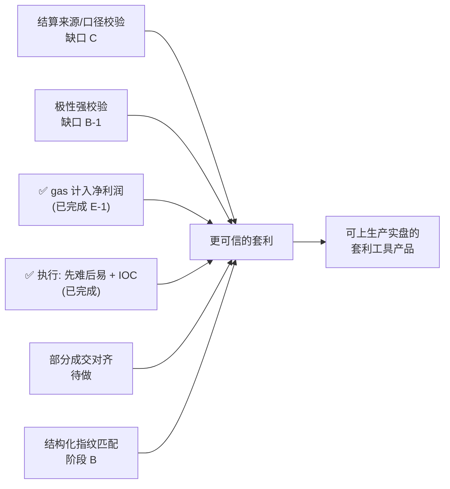

# 14 · 套利理论与影响因素

> **本文是一份持续更新的「活文档」**：套利模型、影响因素、风险认知会随着真实数据、
> 真实下单经验和平台机制的变化不断修正。每次对套利逻辑/风控/匹配的重要改动，都应回到
> 本文同步更新，并在 [09-变更日志.md](./09-变更日志.md) 记录。

本文系统回答三个问题：

1. **套利理论**：跨平台预测市场套利的数学原理是什么，为什么能赚钱。
2. **影响因素**：哪些因素决定一笔"套利"是真赚钱还是假机会/真亏钱，逐条解释。
3. **潜在问题**：套利在检测和执行环节会以哪些方式失败，系统如何防御，还有哪些缺口。

---

## 1. 套利理论基础

### 1.1 二元市场与隐含概率

预测市场的一个二元市场（binary market）就一个 YES/NO 问题报价，例如
「2026 年美联储会降息 4 次吗？」。每一份 YES 合约在事件为「是」时赔付 **$1**，否则 **$0**；
NO 合约相反。因此合约价格本身就是市场对该事件的**隐含概率**：

- YES 价 = 0.30 ⟺ 市场认为该事件发生的概率约 30%。
- 在同一个理性市场内，`P(YES) + P(NO) = 1`（忽略费用/价差）。

### 1.2 跨平台对冲套利的数学（核心）

设**同一个真实事件**在两个平台都有对应市场。我们在不同平台买入**互补**的结果各 N 份：

```
腿 1：在 A 平台买 N 份 YES，单价 a（YES 的 ask）
腿 2：在 B 平台买 N 份 NO，单价 b（NO 的 ask）
```

无论事件最终结算成 YES 还是 NO，**恰好有一边赔付 $1**：

- 结算 YES → 腿 1 的 N 份各赔 $1 = `N×$1`，腿 2 归零。
- 结算 NO → 腿 2 的 N 份各赔 $1 = `N×$1`，腿 1 归零。

所以**组合在任何结果下都稳定赔付 `N×$1`**，而建仓总成本是 `N×(a + b)`。只要：

```
a + b + 单位费用 < 1
```

差额就是**锁定利润**，与事件结果无关。这就是经典的 **Dutch book / 跨平台对冲套利**。

净利润率（系统 `scanner/arbitrage.py` 的实现）：

```
cost_per_pair = a + b                       # 买齐一对互补合约的价
fees_per_pair = fee_A(a) + fee_B(b)         # 两腿费用（取配置模型与市场自报费率较大值）
net_cost      = cost_per_pair + fees_per_pair
net_margin    = (1 − net_cost) / net_cost   # 每投入 $1 成本锁定的利润率
recommended_size_usd = 最薄一条腿的可成交流动性   # 规模受流动性封顶
```

**数字例子**：A 平台 YES ask = $0.46，B 平台 NO ask = $0.49，两平台费用合计 $0.01。

```
net_cost   = 0.46 + 0.49 + 0.01 = 0.96
net_margin = (1 − 0.96) / 0.96  ≈ 4.17%
```

投入 $0.96 锁定 $1，无论结果如何，赚 ~4.17%。

### 1.3 本质：这是「持有到结算」的收敛套利，不是即时无风险套利

这一点极其重要，决定了风险认知：

- 利润**只在两腿都持有到结算、且两平台对同一事件结算结果一致时**才真正落袋。
- 资金从建仓到结算被**锁定**（可能数月），有时间成本与机会成本。
- 两个平台是**两条独立的链/资金池**（Polymarket 在 Polygon 的 USDC，predict.fun 在 BNB Chain），
  不能原子结算，需各自赎回。

> 一句话：套利数学成立，但它的"无风险"建立在一串前提之上（见第 2 节）。任何一个前提破裂，
> "锁定利润"就可能变成"两边都亏"。

---

## 2. 影响因素总览（价值链）

用户真正赚到钱，当且仅当**整条价值链每一环都正确**：



每一环的「出错代价」不同。按代价分三档（Tier）：

| Tier | 含义 | 典型错误 |
|---|---|---|
| **Tier 0** | 灾难级：false positive = 几乎必然真亏钱 | 错配、极性反、结算口径不同 |
| **Tier 1** | 严重：侵蚀或抹掉真实利润 | 流动性不足、滑点、费用/gas、数据陈旧 |
| **Tier 2** | 执行/资金安全控制 | 风控、密钥、稳定性、双腿原子性 |

> 红线清单与系统落地状态详见 [13-匹配算法重设计与正确性红线.md](./13-匹配算法重设计与正确性红线.md)。
> 本文聚焦「为什么」与「失败模式」，与 13 互补。

---

## 3. 影响因素逐条详解

### 3.1 事件身份匹配（Tier 0 · 最致命）

**为什么关键**：套利的"$1 必赔付"假设，建立在两个市场是**同一个真实事件**之上。如果不是同一事件，
你买的就是两个独立的赌注，可能**两边都输**。

**失败模式**：标题词重叠很高但其实是不同事件——
- 「夺得世界杯冠军」 vs 「赢得 A 组」（赛段不同，真实数据中制造过 122% 假套利）。
- 「降息 4 次」 vs 「降息 7 次」（数字阈值不同）。
- 「by April 30」 vs 「before 2027」（结算日期不同，同事件下的按月份分档子市场）。

**系统防线**：`scanner/matching.py` 三重**硬 veto**——任一身份维度不一致即判不同事件、评分归 0：
1. 赛段/范围 `_scope_mismatch`（小组/淘汰赛轮次/组别）。
2. 数字阈值 `_number_mismatch`（行权价/次数/年份）。
3. 结算日期 `_date_mismatch`（相差 >7 天）。

**设计取向（不对称代价）**：漏配 = 错过机会 = 不亏钱；错配 = 真亏钱。**宁可漏，不可错**，
决定性维度用硬 veto 而非软加权。

**缺口**：veto 是启发式，覆盖已知错配模式；新题材（如「当选 vs 提名」「连任 vs 首次当选」）
可能有新模式。结构化指纹匹配（阶段 B）是加固方向。

### 3.2 结果极性对齐（Tier 0）

**为什么关键**：必须保证「腿 1 买的结果」与「腿 2 买的结果」真正**互补**。若极性判断反了，
「买 YES + 买 NO」会变成「买 YES + 买 YES」= **双倍单边裸赌**，根本不是对冲。

**失败模式**：平台用不同措辞表达同一结果（"Yes" / "Will happen" / "Above"），或反向表述
（一方的 NO 等于另一方的 YES）。

**系统防线**：`map_outcomes` + `OutcomeAlignment.inverted` 记录每个平台的极性与是否反转。

**缺口（B-1）**：极性目前靠标题词（not/won't/above/below）判断，较脆弱。应在下单前对每条腿做
「我买的这个结果，赢钱条件是否真与对腿互补」的显式校验，疑似反转直接拒绝。

### 3.3 结算等价（Tier 0）

**为什么关键**：即使是"同一事件"，若两个平台**判定来源、判定标准、判定时间**不同，结算结果就可能
**不一致**——一个平台判 YES、另一个判 NO，于是你**两腿全亏**。

**三个子维度**：
- **结算时间**：同一问题不同截止日 = 不同事件（已由日期 veto 处理）。
- **结算来源**：谁来判定（官方数据源 / 预言机 / 平台人工）。
- **结算口径**：判定的精确措辞（"definitively states" vs "official confirmation" 可能不同）。

**系统防线**：结算日期硬 veto 已落地（`_date_mismatch`）。

**缺口（C）**：结算来源/口径的元数据校验尚未实现，需平台元数据或人工标注。这是目前
**最隐蔽**的 Tier-0 残留风险。

### 3.4 可成交性与流动性（Tier 1）

**为什么关键**：检测用的是**盘口报价**，但你能不能按这个价、这个量成交，取决于**真实深度**。
报价好看但深度只有 $50，实际吃不下你的规模。

**系统防线**：
- 用 **ask**（穿价成本）而非中间价计算，`_effective_ask` 剔除 ask≈0 的脏档位。
- `recommended_size_usd` 按**最薄一条腿的流动性**封顶（Property 9）。
- predict.fun 订单簿做**反穿价**（`_uncross`）剔除脏挂单。

**缺口**：盘口深度是**快照**，下单时可能已变（见 4.2 leg risk）。

### 3.5 隐含概率背离（Tier 1 · 强危险信号）

**为什么关键**：同一事件两平台的隐含概率**本应接近**。若背离很大（如 Polymarket 0.4% vs
predict.fun 17.6%），说明一侧定价脏/薄/结算口径不同——**大价差是危险信号，不是中奖**。

**经验法则**：真正的跨平台套利价差**很小（1–5%）**；出现 **20%+** 的"套利"几乎一定是
数据/匹配/口径问题。

**系统防线**：`max_implied_prob_divergence`（默认 0.10）——两平台隐含 P(YES) 背离超过阈值
直接跳过；仪表盘对背离 >10% 红色警告。

### 3.6 费用与 gas（Tier 1）

**为什么关键**：净利润率必须扣掉**全部成本**才真实。漏算费用会高估利润，把不赚的当成赚的。

**系统防线**：`_leg_fee` 取「配置费用模型」与「市场自报费率（如 predict.fun feeRateBps→2%）」的
**较大值**，永不低估费用（修复过外星人单 2.1%→0.36% 的高估 bug）。

**链上 gas（缺口 E-1）✅ 已建模**：`gas_cost_per_leg_usd` + `min_net_profit_after_gas_usd` 配置。
**关键设计点**：gas 是**每笔交易的固定成本，不随规模缩放**（与按名义额缩放的费用本质不同），故在
**整笔交易**层面核算——`扣gas后利润 = recommended_size×net_margin − 腿数×gas`，低于下限则跳过；
机会上新增 `gas_cost_usd`/`net_profit_after_gas_usd` 字段如实呈现。默认不建模（=0，行为不变、字段为
None 表示"未建模"），运营者按实际链况配置。详见 [15-设计决策记录.md](./15-设计决策记录.md) ADR-004。

**剩余**：gas 估算目前为静态配置，未来可动态读取链上实时 gas price。

### 3.7 数据新鲜度（Tier 1）

**为什么关键**：用过期报价交易 = 按一个已经不存在的价格下注。

**系统防线**：staleness 阈值 + 过期组不评估（Property 5）；`pinned_ids` 固定抓取已匹配市场，
避免套利对忽隐忽现。

### 3.8 双腿原子性 / Leg Risk（Tier 2 · 执行头号风险）

见第 4.2 节专门展开——这是套利**执行**环节最核心的风险。

### 3.9 跨链与资金分布

两个平台在**不同链**（Polygon / BNB Chain），意味着：
- 无法原子执行两腿，天然存在时间窗（leg risk 的根源）。
- 需在两条链各备资金、各自赎回，资金利用率与运营复杂度上升。

### 3.10 结算结果一致性与作废/退款

- 某些市场可能"无效/作废/50-50 退款"结算，这会打破"$1 必赔付"假设。
- 两平台对同一事件的最终判定若不一致（见 3.3），对冲失效。

### 3.11 时间价值与资金锁定

资金从建仓到结算被锁定（可能数月）。年化收益需把**锁定时长**纳入考量：锁定 6 个月赚 4% ≈
年化 8%，与锁定 1 周赚 4% 完全不同。

---

## 4. 潜在问题与失败模式

### 4.1 失败模式决策树



### 4.2 Leg Risk：一腿流动性不足/未成交（执行头号风险）

**问题**：买入 A 腿 YES 成交了，但 B 腿 NO 因流动性不足没成交 → 手里只剩一个**方向性裸赌注**，
完全不是对冲。事件结算成持有那边则赚，结算成另一边则**那条腿本金几乎全亏**。

**系统处理**（`scanner/execution_engine.py`）：



**现有防线**：
- 规模按**最薄腿**封顶，降低吃不下的概率。
- **先难后易执行**：按可成交流动性升序下单，先下最难成交的腿；若它失败，此时尚未动用
  其它腿，无需补救、损失最小（`execute_plan` 排序执行）。
- **全成或撤（IOC）**：一腿**未完全成交即视为失败**，并**立即撤掉未成交挂单**
  （`_kill_remainder`），绝不留挂单在我们补救完之后才成交、凭空产生新裸敞口。
- 已成交的部分立即反向平掉；平仓也失败时记录"残余敞口"并告警，等人工介入。

**结构性局限（诚实说明）**：
1. **跨链无法原子成交**——时间窗不可消除，只能控制。
2. **盘口深度是快照**——下单时可能已被吃掉/撤掉。
3. **平仓本身要穿价吃滑点**——即便成功也是真金白银的损失。
4. ~~下单顺序非"先难后易"~~ → ✅ **已改为先难后易**（按流动性升序执行）。
5. ~~无 IOC/全成或撤语义~~ → ✅ **已实现全成或撤**（未全成即撤掉剩余挂单）。

**改进方向（已识别，按优先级）**：
1. ✅ **先下流动性最差的腿**（失败时损失最小）——已实现。
2. ✅ **IOC / 全成或撤**（不能立即全额成交就撤单，绝不挂单裸露）——已实现。
3. **部分成交对齐**（两腿成交量不等时平掉多出的不对冲部分）——待做。
4. **gas 计入净利润**（缺口 E-1）——待做。

### 4.3 滑点

实际成交价偏离检测报价。系统按**实际成交均价**核算已实现收益
（`_record_realized_pnl`），能识破"检测为正、滑点后实亏"的情形；风控含滑点保护阈值。

### 4.4 大价差陷阱（复盘）

「Will 7 Fed rate cuts happen in 2026?」曾报出 20.8% 假套利：Polymarket（$2.3M 深度）定
P=0.35%，predict.fun（薄盘）定 17.6%，50 倍背离全靠一侧离谱定价；流动性仅 $65，毛利约 $13.5，
gas 易吃掉；再查时机会已消失。**教训：大价差几乎一定是问题，不是免费的钱**。

---

## 5. 净利润率计算模型（与系统实现对照）

```
输入：每条腿的 ask 价 aᵢ、费率、流动性 depthᵢ
1. cost_per_pair = Σ aᵢ                         （买齐互补合约各一份）
2. fees_per_pair = Σ max(feeModelᵢ(aᵢ), rateᵢ·aᵢ)   （取较大值，不低估费用）
3. net_cost      = cost_per_pair + fees_per_pair
4. net_margin    = (1 − net_cost) / net_cost
5. size_usd      = min(depthᵢ)                  （最薄腿封顶）
6. 合约数 N      = size_usd / cost_per_pair
7. 闸门：net_margin ≥ 最小利润率阈值
        且 隐含概率背离 ≤ max_implied_prob_divergence
        且 size_usd ≥ min_recommended_size_usd
        且 数据新鲜（非 stale）
        且 匹配置信度 ≥ match_confidence_min
```

> 待补（缺口）：步骤 2 应加入**链上 gas** 估算；步骤 7 应加入**结算来源/口径**一致性校验。

---

## 6. 套利模型的当前防线与缺口一览

| 影响因素 | Tier | 系统防线 | 状态 |
|---|---|---|---|
| 事件身份匹配 | 0 | 赛段/数字/日期 三重硬 veto | ✅ 已堵主要模式；结构化指纹待做 |
| 结果极性对齐 | 0 | `map_outcomes` + inverted | ⚠️ 靠标题词，需强校验（B-1） |
| 结算时间等价 | 0 | 结算日期硬 veto | ✅ 已落地 |
| 结算来源/口径 | 0 | — | ❌ 缺口 C（最隐蔽残留风险） |
| 流动性/可成交性 | 1 | ask 定价 + 最薄腿封顶 + 反穿价 | ✅ 基本到位（快照局限） |
| 隐含概率背离 | 1 | `max_implied_prob_divergence` + 仪表盘警告 | ✅ |
| 费用 | 1 | `_leg_fee` 取较大值 | ✅ |
| 链上 gas | 1 | gas 整笔固定成本核算 + 扣 gas 后绝对利润闸门（`gas_cost_per_leg_usd`） | ✅ 已建模（默认关闭，按实际链况配置）；可升级为动态 gas price |
| 数据新鲜度 | 1 | staleness 阈值 + pinned 抓取 | ✅ |
| 双腿原子性 / leg risk | 2 | 先难后易执行 + IOC 全成或撤 + 补救平仓 + 残余敞口告警 | ✅ 已加先难后易+IOC；缺部分成交对齐 |
| 滑点 | 1 | 实际成交价核算 + 风控滑点保护 | ✅ |
| 风控闸门 | 2 | 敞口/滑点/利润/dry-run/人工确认 | ✅ |
| 密钥/资金安全 | 2 | 浏览器钱包签名，私钥不上服务器 | ✅（真实下单待接入） |

---

## 7. 持续优化方向（路线）



优先级建议：**C/B-1（防真亏钱）> 部分成交对齐（防裸敞口残留）> 阶段 B（扩覆盖面）**。
执行层 leg risk 两项主防御（先难后易、IOC）与 gas 计入（E-1）已落地。

---

## 8. 维护约定（活文档）

- 每次改动**匹配 veto / 套利计算 / 风控 / 执行**逻辑，回到本文同步影响因素与缺口状态。
- 真实下单获得新的失败案例后，补充到第 4 节"失败模式"并复盘。
- 与 [13-匹配算法重设计与正确性红线.md](./13-匹配算法重设计与正确性红线.md)（红线清单）保持一致；
  本文侧重"为什么/失败模式/理论"，13 侧重"红线清单/决策项"。
- 重要更新在 [09-变更日志.md](./09-变更日志.md) 记录。
