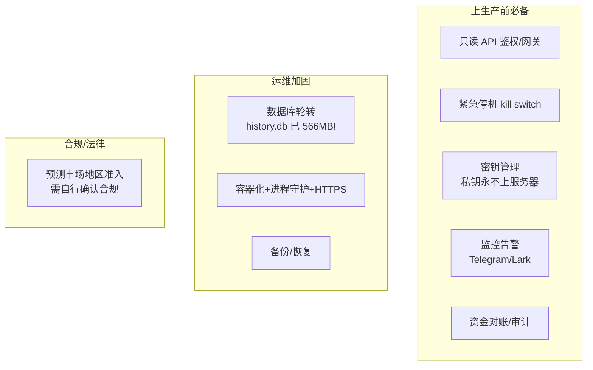
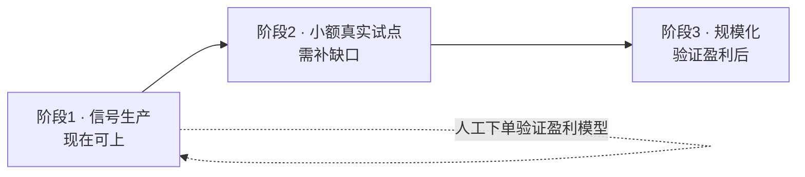

# 16 · 生产就绪评估（能否上生产盈利？）

> 本文诚实评估：当前项目**能不能部署上生产、开始作为生产级项目盈利**；不能的话，**还差什么**。
> 结论先行，再逐项展开。随开发推进持续更新。

---

## 0. 结论速览（TL;DR）

| 部署形态 | 现在能否上 | 说明 |
|---|---|---|
| **形态 A：信号工具（只读 + 人工执行）** | ✅ **可以** | 系统稳定、642 测试通过，能实时检测跨平台套利信号并在仪表盘呈现。用户**手动**去两个平台下单即可尝试盈利。需补少量运维加固（见第 3 节）。 |
| **形态 B：半自动（系统建议 + 人工确认 + 自动下单）** | ⚠️ **还不行** | 缺**真实执行适配器**（链上下单 + 钱包签名）。风控/确认流/模拟盘/dry-run 都已就绪，只差真实下单这一步（切片 N）。 |
| **形态 C：全自动盈利** | ❌ **不建议** | 跨链不可原子 + Tier-0 残留风险（结算口径）+ 合规问题，全自动风险过高。**不应作为近期目标**。 |

**一句话**：项目已经是一个**可上生产的"套利信号工具"**（形态 A），但**还不是一个能"自动赚钱"的系统**
（形态 B/C）。要自动盈利，核心缺一个**真实链上执行适配器**，外加若干 Tier-0 正确性缺口与生产运维加固。

---

## 1. 为什么现在能以「信号工具」上生产

已具备的生产级能力：
- **数据**：双平台实时摄取，限流/退避/熔断自愈，休眠后自恢复，消失市场清理，新鲜度保证。
- **匹配正确性**：赛段/数字阈值/结算日期三重硬 veto，防错配虚假套利（Tier-0 红线 A/C-时间）。
- **套利质量**：用 ask 定价、费用取较大值、隐含概率背离闸门、薄盘规模闸门、**gas 核算**。
- **可观测性**：JSON 日志、`/metrics`、平台健康、仪表盘。
- **持久化**：信号/历史/交易 SQLite，跨重启可恢复、可审计。
- **测试**：642 个离线确定性测试全过。

> 这一形态下，盈利靠**人工**：系统找信号、人去执行。**没有任何真实下单代码路径被触发**，资金风险可控。

---

## 2. 盈利的硬缺口（阻断「自动下单赚钱」的关键项）

### 2.1 真实执行适配器（切片 N · **头号缺口**）
当前所有"执行"都走 `PaperExecutionAdapter`（模拟盘，不动真钱）+ 默认 dry-run。**没有真实下单能力**：
- 需实现对接 **Polymarket CLOB / predict.fun** 的 `ExecutionAdapter`（下单/撤单/查单/查余额持仓）。
- 需 **钱包 EIP-712 签名**（predict.fun：取 auth message → 签名换 JWT → 签订单；Polymarket：CLOB 签名）。
- 架构已确认：**私钥不离浏览器、服务器不接触私钥**（前端钱包签名 → 提交平台 API）。
- **没有它，系统无法自动完成任何一笔真实交易。**

### 2.2 结算来源/口径一致性校验（缺口 C · Tier-0 · 最隐蔽风险）
两个平台即使是"同一事件、同一日期"，若**判定来源/标准**不同，可能结算结果不一致 → 两腿全亏。
目前只校验了结算**时间**（日期 veto），**来源/口径未校验**。需平台元数据或人工标注，或对高价值机会
强制人工确认。

### 2.3 结果极性强校验（缺口 B-1 · Tier-0）
极性目前靠标题词（not/won't/above/below）判断，较脆弱。下单前应显式校验「我买的这个结果，赢钱条件
是否真与对腿互补」，疑似反转直接拒绝。

### 2.4 部分成交对齐（执行 · 裸敞口残留）
两腿成交量不等时（如 A 成 100、B 成 60），多出的 40 是裸敞口。当前 IOC 会撤未成交挂单并平掉，但
"已成交但不对冲的多余部分"的自动对齐尚未实现。

### 2.5 gas 动态化（缺口 E-1 已建模、可加强）
gas 已能计入（静态配置）；生产中应按链上**实时 gas price**动态估算，避免低估/高估。

---

## 3. 非功能性生产支持（运维 / 基础设施 / 安全）

| 项 | 现状 | 缺口 / 待办 |
|---|---|---|
| **只读 API 鉴权** | 交易 API 有 `X-API-Key`；**只读 API 无鉴权** | 对外开放前必须置于带认证的反向代理/网关之后 |
| **紧急停机（kill switch）** | 有 dry-run/人工确认；无一键停所有下单的开关 | 真实下单前必须加 kill switch |
| **密钥管理** | 设计为私钥不上服务器（浏览器签名）；API key 走环境变量 | 生产需密钥托管/轮转流程 |
| **监控告警** | JSON 日志 + `/metrics` + LogChannel | 接 Prometheus/告警到 Telegram/Lark（已规划，未做） |
| **资金对账/审计** | 交易/订单持久化、已实现收益核算 | 真实资金的对账流程、异常告警、定期审计 |
| **数据库运维** | SQLite history/signals/trades | ⚠️ **history.db 已 566MB**：需降采样/保留窗口收紧/轮转（已识别技术债） |
| **部署形态** | uvicorn 单进程 | 容器化、进程守护（systemd/supervisor）、HTTPS、健康探针、资源限制 |
| **CI/CD** | 本地 pytest | CI 自动跑测试 + 覆盖率（已规划） |
| **合规/法律** | — | 预测市场在部分法域受限/禁止；**是否可合法参与需运营者自行确认，本项目不提供法律意见** |

---

## 4. 推荐的分阶段上线路径

**阶段 1 · 信号生产（现在就能上）**
- 部署只读信号工具（形态 A），置于带鉴权的网关后。
- 补：只读 API 鉴权、监控告警、history.db 轮转、容器化部署。
- 用**人工下单**验证"信号是否真能赚钱"——这是上真实自动化前最便宜的盈利模型验证。

**阶段 2 · 小额真实下单试点（需补缺口）**
- 硬前置：切片 N（真实执行适配器）+ kill switch + 缺口 C/B-1 的至少"人工确认"兜底。
- 默认 dry-run + 显式开关 + 二次确认；**最小金额**、人工监督、逐笔核对成交与持仓。
- 在两条链各备小额资金，跑通"真实行情 → 信号 → 风控 → 人工确认 → 真实下单 → 双腿成交 → 持仓核对"。

**阶段 3 · 规模化（验证盈利后）**
- 放宽风控规模、提高自动化程度、扩展平台与题材。

---

## 5. 盈利能力的现实预期（诚实）

- **真套利价差很小（1–5%）**，且**机会稀少**——大价差几乎都是数据/匹配/口径问题（见 docs/14）。
- **资金锁定到结算**（可能数月），年化收益要按锁定时长折算。
- **跨链运营成本**：两条链各备资金、各自赎回、gas 成本、价格滑点都侵蚀利润。
- **竞争**：成熟套利者机器人速度快，留给手动/半自动的窗口有限。
- 因此现实预期是：**这是一个辅助发现机会、控制风险的工具，不是印钞机**。先用信号 + 人工验证盈利
  模型是否成立，再决定要不要投入做真实自动化。

---

## 6. Go-Live 检查清单（真实下单前必须全绿）

- [ ] 真实执行适配器实现并通过 dry-run 真实账户验证（切口 N）
- [ ] 结算来源/口径校验 或 高价值机会强制人工确认（缺口 C 兜底）
- [ ] 结果极性强校验（缺口 B-1）
- [ ] 部分成交对齐 + 残余敞口告警闭环
- [ ] gas 按实时 gas price 估算
- [ ] kill switch（一键停所有下单）
- [ ] 只读 API 鉴权 + HTTPS + 网关
- [ ] 监控告警接入（Telegram/Lark）+ 资金对账流程
- [ ] history.db 等数据库轮转/备份
- [ ] 容器化部署 + 进程守护 + 健康探针
- [ ] 合规确认（法域准入，运营者自行负责）
- [ ] 小额真实下单试点通过

> 维护约定：每完成一项缺口/检查项，回到本文勾选并在 [09-变更日志.md](./09-变更日志.md) 记录。
