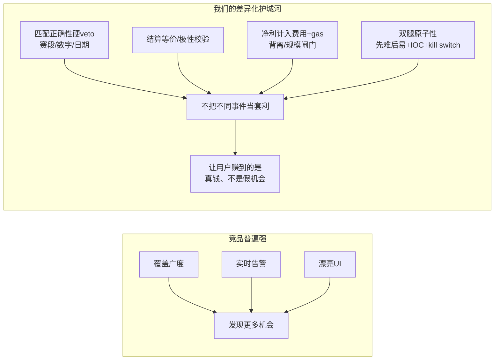
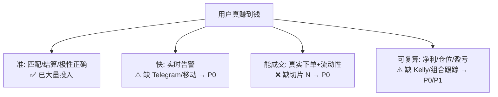

# 17 · 产品路线图与竞品调研

> 本文回答：作为「帮用户套利赚钱的工具」，对标 matchr 及同类竞品，我们**还缺哪些功能**、
> 按什么优先级开发。**前几个阶段聚焦「帮用户真盈利」的核心**，增长/商业化功能靠后。
> 持续更新。内容综合了公开竞品资料（见文末来源），已改写以符合引用规范。

---

## 1. 竞品调研速览（2026）

预测市场套利/聚合工具这两年快速涌现，可分三类：

| 工具 | 形态 | 招牌功能 | 对我们的启发 |
|---|---|---|---|
| **matchr.xyz** | Web | 跨平台「Matches」配对卡、价差排序、AI 匹配、诚实免责 | 卡片+列表/详情形态（已借鉴） |
| **ArbBets** | Web/订阅 | 监控 990+ 市场、100+ 机会/日、**实时告警**（强调"机会几分钟内消失，人工漏掉 95%"） | **覆盖广度 + 实时告警是刚需** |
| **MarketMaster** | 浏览器插件 | 在平台页面浮层显示跨平台价、YES/NO/HOLD 结论、**edge 评分**、**四分之一 Kelly 建议仓位**、一键新闻上下文 | **Kelly 规模 + 插件浮层 + 新闻** |
| **OmniPred / polykal** | Web | Polymarket vs Kalshi 赔率对比、AI 匹配、"保证利润"计算 | 对比视图（已具备） |
| **OddsJam Prediction Insiders** | 订阅 | 跟踪高胜率"内部人"、实时信号、信心分、直达下单链接 | 信号 + 一键下单链接 |
| **OddsShopper PortfolioEV** | Web/App | **按 bankroll 推荐仓位**、+EV、**组合盈亏增长跟踪**、移动告警、批量下单 | **组合/盈亏跟踪 + 移动告警 + 批量** |
| **Robinhood 预测市场** | App | 限价单、按金额下单、24/7、事件详情页、AI 个性化摘要 | 主流化的下单/详情体验 |

**行业共识（多个来源印证我们的设计取向）**：
- 真套利**价差很小**（普遍说法是需净 **3–5¢** 才值得做），**机会几分钟内消失** → 实时性是命脉。
- **费用、滑点、转账延迟、结算规则不一致**会快速吃掉毛价差 → 这正是我们 Tier-0/1 红线在防的。
- 很多竞品宣传"risk-free guaranteed profit"，但实务文章普遍承认 **resolution-rule mismatch（结算口径不一致）** 是真实风险——**这恰是我们的差异化诚实点**。

---

## 2. 我们的定位与差异化

市面工具大多偏「发现机会 + 喊单」，对**正确性与执行风险**轻描淡写（甚至用"稳赚"营销）。我们的差异化：

**一句话定位**：别人帮你"看到更多价差"，我们帮你"只下**真能赚钱**的那一单"——把"看着稳赚实则必亏"的假机会挡在门外。这是给用户长期赚钱的根本。

---

## 3. 功能差距矩阵（对标竞品）

| 能力 | 竞品标配 | 我们现状 | 缺口/优先级 |
|---|---|---|---|
| 跨平台匹配 + 价差检测 | ✅ | ✅ 三重硬 veto，质量更高 | — |
| 净利计入费用/gas | 部分 | ✅ 费用取较大值 + gas 建模 | — |
| 列表/详情卡片 UI | ✅（matchr） | ✅ 卡片 + 详情页 | — |
| 模拟盘/风控/kill switch | 少见 | ✅ | — |
| **实时告警**（Telegram/推送） | ✅ 刚需 | ⚠️ 有 Log/Webhook，缺 Telegram/移动 | **P0** |
| **真实下单执行** | ✅（或跳转平台） | ❌ 仅模拟盘（缺切片 N） | **P0** |
| **Kelly/bankroll 建议仓位** | ✅（MarketMaster/OddsShopper） | ❌ 有风控规模上限，无 Kelly | **P0** |
| **平台覆盖广度** | ✅ 3–5+ 平台 | ⚠️ 2 个（Polymarket+predict.fun） | **P1** |
| **组合/持仓/盈亏增长跟踪** | ✅（PortfolioEV/Robinhood） | ⚠️ 有单笔已实现收益，缺组合时序/ROI 曲线 | **P1** |
| 结算口径一致性校验 | ❌（普遍忽略） | ⚠️ 已做日期，缺来源/口径（缺口 C） | **P1（差异化）** |
| 机会历史/命中率统计 | 部分 | ⚠️ 有净利率时序，缺"出现频率/实现率"统计 | **P1** |
| 浏览器插件浮层 | ✅（MarketMaster） | ❌ | **P2** |
| 新闻/情报上下文 | ✅（MarketMaster/OddsJam） | ❌ | **P2** |
| 移动 App | 部分 | ❌（响应式 Web 可先顶） | **P2** |
| 账号/订阅/计费 | ✅ | ❌ | **P2（商业化）** |

---

## 4. 分阶段路线图（聚焦盈利核心）

### 阶段 P0 — 盈利核心闭环（最高优先，先让用户真能赚到第一笔）
目标：用户能**及时收到**一个**真能成交、扣完成本仍盈利**的机会，并**按合理仓位**完成下单、**看到真实盈亏**。

1. **真实执行适配器（切片 N）** — 头号缺口。对接 Polymarket CLOB / predict.fun 下单，钱包 EIP-712 签名（私钥不离浏览器）。无此则"赚钱"只能靠人工。
   - 硬前置已就绪：风控、确认流、dry-run、kill switch、先难后易+IOC。
2. ✅ **实时告警到 Telegram/Lark**（`TelegramChannel`/`LarkChannel` 已实现）— 机会几分钟即逝，告警是命脉。凭证经环境变量注入，缺失优雅降级。**待你提供 Bot token+chat id 或 Lark webhook 即生效。**
3. ✅ **Kelly / bankroll 建议仓位**（`scanner/sizing.py` 已实现）— 在风控规模上限内，按 bankroll×¼ 给出建议仓位上限。**待你填入 `risk.bankroll_usd`（你的本金）即启用。**
4. **可成交性强化** — 真实下单前再校验盘口深度/滑点（已有 ask 定价+最薄腿封顶，补下单时的实时再确认）。

### 阶段 P1 — 信任与留存（让用户敢持续用、看得到长期 ROI）
5. **组合 / 持仓 / 盈亏增长跟踪** — 历史已实现收益时序、ROI 曲线、绿/红天、累计盈亏（对标 PortfolioEV/Robinhood Digests）。
6. **机会统计** — 出现频率、平均持续时长、**检测→实际成交的实现率**、按题材/平台的盈利分布（用我们已有的信号生命周期 + 历史数据）。
7. **结算口径一致性校验（缺口 C，差异化护城河）** — 引入结算来源/规则元数据或人工标注，对高价值机会强制确认，进一步杜绝"两边都输"。
8. **平台覆盖扩展** — 接 Kalshi（已禁用待启）、Manifold、Robinhood 等，覆盖广度直接决定机会数量。
9. **极性/结算等价的可视化解释** — 详情页用通俗语言说明"为什么这是同一事件、为什么对冲"，建立信任。

### 阶段 P2 — 增长与商业化
10. 浏览器插件浮层（在平台页面直接显示跨平台价 + 我们的可靠性判定）。
11. 新闻/情报上下文（事件相关新闻、大额持仓异动）。
12. 移动端（先做响应式 Web，再考虑原生）。
13. 账号体系 + 订阅/计费（可按"已帮用户锁定的净利"或订阅制）。

---

## 5. 为什么前几阶段必须聚焦"盈利核心"

帮用户赚钱 = 同时满足四件事，缺一不可（这也是我们排序 P0 的依据）：

- 漂亮的 UI、插件、新闻、订阅都是**放大器**，但**放大的前提是核心闭环能赚钱**。
- 所以 P0 只做四件事：**真实下单（能成交）+ 实时告警（快）+ Kelly 仓位（可复算）+ 可成交再校验**，叠加已有的正确性护城河（准）。

---

## 6. 维护约定
- 新功能先归入对应阶段（P0/P1/P2）并注明"为盈利核心贡献了什么"。
- 与 [08-迭代计划.md](./08-迭代计划.md)（切片级任务）、[16-生产就绪评估.md](./16-生产就绪评估.md)（上线缺口）保持一致：本文是**产品视角**，08 是**工程切片**，16 是**上线门槛**。
- 完成项在 [09-变更日志.md](./09-变更日志.md) 记录。

---

## 来源（已改写，符合引用规范）
- [Best Prediction Market Tools & Trackers 2026 — tradealgo](https://www.tradealgo.com/trading-guides/prediction-markets/prediction-market-tools)
- [Prediction Market Arbitrage 2026 — tech-insider](https://tech-insider.org/prediction-market-arbitrage/)（结算规则不一致风险）
- [Best Prediction Market Arbitrage Tools 2026 — getarbitragebets](https://getarbitragebets.com/blog/best-prediction-market-arbitrage-tools)（覆盖广度/实时性）
- [MarketMaster 插件 — Chrome Web Store](https://chromewebstore.google.com/detail/marketmaster-%E2%80%94-prediction/logjckilniokipjfcfjhglhhiemjlfab)（edge 评分 / ¼-Kelly / 新闻）
- [OmniPred](https://www.omnipred.com/)、[polykal](https://polykal.app/)（跨平台赔率对比）
- [OddsJam Prediction Insiders 评测 — bettoredge](https://www.bettoredge.com/post/oddsjam-prediction-insiders-review)（信号/信心分/一键下单）
- [OddsShopper PortfolioEV](https://www.oddsshopper.com/portfolioev)（bankroll 仓位 / 组合盈亏跟踪 / 移动告警）
- [Robinhood 预测市场更新](https://robinhood.com/us/en/newsroom/robinhood-presents-yes-no-event/)（限价单/详情页/AI 摘要）

> 注：以上为综合公开资料并改写，仅作产品参考；不代表对各工具盈利宣称的背书。
